<<<<<<< HEAD
<!--
  Profile README for github.com/sambitg31/sambitg31
-->

<table>
<tr>
<td valign="top"></td>
<td valign="top"></td>
</tr>
</table>

## Sambit Ghosh

**Full-Stack Developer · AI/ML Builder · Hackathon Participant**

 

<!-- animated contribution graph, refreshed daily by the workflow -->

=======
<h1 align="center">Hi 👋, I'm Sambit Ghosh</h1>
<h3 align="center">I'm passionate about exploring different technical domains</h3>

  

  

- 🌱 I’m currently learning **Web3,Blockchain**

- 📫 How to reach me **sambit1089@gamil.com**

<h3 align="left">Connect with me:</h3>

<h3 align="left">Languages and Tools:</h3>

          

&nbsp;

>>>>>>> 0f09f4156cce2f43a7b3bd4b65fb8f6ac5abc8f3
